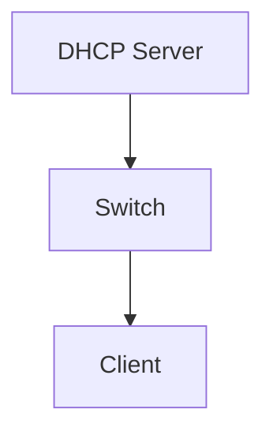
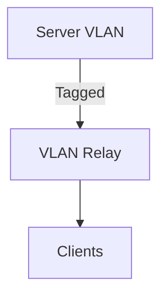
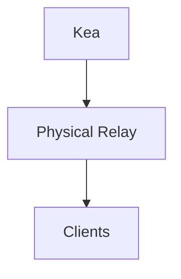
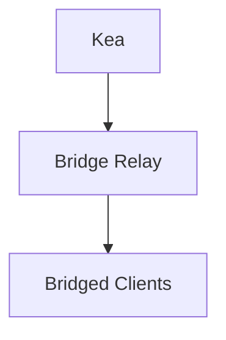

# The Setup
---

This guide provides an implementation of a DHCP relay environment. It is split into two parts: the **Relay Host (The Switch)** and the **DHCP Server (The Kea Instance)**.

---

# Part 1: The DHCP Server (Kea 3.0)

## 1. Install ISC Kea 3.0

```bash
curl -1sLf 'https://dl.cloudsmith.io/public/isc/kea-3-0/setup.deb.sh' | bash
apt update && apt install -y isc-kea isc-kea-mysql
```

## 2. Configure database for kea leases.

```bash
root@localhost:~# mysql 

MariaDB [(none)]> CREATE USER 'dilraj'@'localhost' IDENTIFIED BY 'dilraj';
Query OK, 0 rows affected (0.016 sec)

MariaDB [(none)]> CREATE DATABASE kea_dhcp;
Query OK, 1 row affected (0.001 sec)

MariaDB [(none)]> GRANT ALL PRIVILEGES ON kea_dhcp.* TO 'dilraj'@'localhost';
Query OK, 0 rows affected (0.012 sec)

MariaDB [(none)]> FLUSH PRIVILEGES;
Query OK, 0 rows affected (0.001 sec)

root@localhost:~$ kea-admin db-init mysql -u dilraj -p dilraj -n kea_dhcp
Checking if there is a database initialized already...
Verifying create permissions for dilraj
MySQL Version is: 11.8.3-MariaDB-0+deb13u1 from Debian
Initializing database using script /usr/share/kea/scripts/mysql/dhcpdb_create.mysql
Schema version reported after initialization: 30.0
```

---

## 2. Configure Kea (`/etc/kea/kea-dhcp4.conf`)

> Note: The `relay` block inside `subnet4` is the **anchor**.
> When Kea sees a packet where `giaddr` matches the relay IP, it assigns an address from the corresponding pool. (giaddr means the address directly assigned to port which faces clients directly)

> ⚠ **Note**
>
> * Configuration below is **annotated**
> * Remove comments and trailing commas before production
> * Kea requires **strict JSON**

### `/etc/kea/kea-dhcp4.conf` (Boilerplate)

```json
{
    "Dhcp4": {
        "interfaces-config": {
            "interfaces": ["enp8s0","enp9s0", "enp11s0", "vlan10", "vlan20"] // Only mention interfaces we are listening on. no extras to avoid DHCP leaks to un-desired interfaces
        },
        "control-socket": {
            "socket-type": "unix",
            "socket-name": "/var/run/kea/kea4-ctrl-socket"
        },
        "lease-database": {
            "type": "mysql",
            "name": "kea_dhcp",
            "user": "dilraj",
            "password": "dilraj",
            "host": "localhost",
            "port": 3306,
            "connect-timeout": 5,
            "max-reconnect-tries": 10,
            "reconnect-wait-time": 2000,
            "on-fail": "stop-retry-exit"
        },
        "hosts-database": {
            "type": "mysql",
            "name": "kea_dhcp",
            "user": "dilraj",
            "password": "dilraj",
            "host": "127.0.0.1",
            "port": 3306
        },
        "expired-leases-processing": {
            "reclaim-timer-wait-time": 10,
            "flush-reclaimed-timer-wait-time": 25,
            "hold-reclaimed-time": 3600,
            "max-reclaim-leases": 100,
            "max-reclaim-time": 250,
            "unwarned-reclaim-cycles": 5
        },
        "calculate-tee-times": true,
        "valid-lifetime": 86400,
        "option-data": [
            {
                "name": "domain-name-servers",
                "data": "8.8.8.8"
            }
        ],

        "hooks-libraries": [
            {
                "library": "/usr/lib/x86_64-linux-gnu/kea/hooks/libdhcp_mysql.so"
            },
            {
                "library": "/usr/lib/x86_64-linux-gnu/kea/hooks/libdhcp_host_cmds.so"
            }
        ],

        "subnet4": [
            {
                "id": 1,
                "subnet": "10.9.0.0/24",
                /* ^ Subnet to be alloted" */
                "pools": [
                    { "pool": "10.9.0.2 - 10.9.0.244" } // First and last ip that can be assigned in the subnet to clients
                ],
                "option-data": [
                    { "name":"routers", "data":"10.9.0.1" },
                    /* ^ This shows us how to push default route */
                ]
            },
            {
                "id": 2,
                "subnet": "10.10.10.0/24",
                "relay": {
                    "ip-addresses": [ "10.10.10.1" ] // This address indicates where the DHCP assignments will be sent. If this address is not specified, it is assumed that the VLAN or physical interface is directly connected to the firewall. For example, enp13s0 is connected to a switch, which then connects to the client-facing port on the switch. Here the client-facing port's IP is mentioned here.
                  },
                "pools": [
                    { "pool": "10.10.10.100 - 10.10.10.200" }
                ],
                "option-data": [
                    { "name": "routers", "data": "10.10.10.1" }
                ],
                "interface" : "enp13s0" // this is the interface it will be bound to. such that only this interface will get the pool. In case of relays, we put the interface where the relay is accessible. In case its directly connected, we mention that. example: enp13s0 ----connected to a switch ----> port on switch
            },
            {
                "id": 3,
                "subnet": "10.20.20.0/24",
                "relay": {
                    "ip-addresses": [ "10.20.20.1" ]
                },
                "pools": [
                    { "pool": "10.20.20.100 - 10.20.20.200" }
                ],
                "option-data": [
                    { "name": "routers", "data": "10.20.20.1" }
                ]
            },
            {
            	"id": 4,
            	"subnet": "10.10.0.0/24",
            	"pools": [
            	    { "pool": "10.10.0.69 - 10.10.0.200" }
            	],
            	"option-data": [
            	    { "name": "routers", "data": "10.10.0.1" }
            	],
            	"interface" : "enp9s0"
            },
            {
               	"id": 5,
               	"subnet": "10.15.20.0/24",
               	"relay": {
               	    "ip-addresses": [ "10.15.20.1" ]
               	},
               	"pools": [
               	    { "pool": "10.15.20.69 - 10.15.20.200" }
               	],
               	"option-data": [
               	    { "name": "routers", "data": "10.15.20.1" }
               	],
               	"interface" : "enp9s0"
           },
           {
               	"id": 6,
               	"subnet": "10.30.30.0/24",
               	"relay": {
               	    "ip-addresses": [ "10.30.30.1" ]
               	},
               	"pools": [
               	    { "pool": "10.30.30.69 - 10.30.30.200" }
               	],
               	"option-data": [
               	    { "name": "routers", "data": "10.30.30.1" }
               	]
           },
           {
               	"id": 7,
               	"subnet": "10.40.40.0/24",
               	"relay": {
               	    "ip-addresses": [ "10.40.40.1" ]
               	},
               	"pools": [
               	    { "pool": "10.40.40.69 - 10.40.40.200" }
               	],
               	"option-data": [
               	    { "name": "routers", "data": "10.40.40.1" }
               	]
           }
        ]
        
    }
}

```

Run:

```bash
kea-dhcp4 -t /etc/kea/kea-dhcp4.conf
systemctl restart isc-kea-dhcp4-server
```

---

# Multi-Subnet DHCP Deployment (Kea + systemd-networkd)

This section documents a **multi-case DHCP serving setup** using **Kea DHCPv4** with
interface and topology management handled entirely by **systemd-networkd**.

The design demonstrates:

* Flat (direct) DHCP serving
* DHCP relay over physical interfaces
* DHCP relay over VLANs
* DHCP relay over Linux bridges

---

## Topology Overview

* **DHCP Server**

  * Runs Kea DHCPv4
  * Interfaces managed via `systemd-networkd`
* **Switch (Linux-based)**

  * L2 access
  * L3 gateway
  * DHCP relay
  * VLAN termination
  * Bridge endpoint

---

## Case Matrix (High Level)

| Case | Subnet              | Mode                |
| ---: | ------------------- | ------------------- |
|    1 | `<FLAT_SUBNET>`     | Flat / Direct DHCP  |
|    2 | `<VLAN_SUBNET>`     | VLAN-based Relay    |
|    3 | `<PHYSICAL_SUBNET>` | Physical Port Relay |
|    4 | `<BRIDGE_SUBNET>`   | Bridge-based Relay  |

---

## Case 1 – Flat DHCP

### Switch Configuration

```ini
# <SWITCH_IFACE>.network
[Match]
Name=<SWITCH_IFACE>

[Network]
Address=<SWITCH_IP>/<PREFIX>
```

### Server Configuration

```ini
# <SERVER_IFACE>.network
[Match]
Name=<SERVER_IFACE>

[Network]
Address=<SERVER_IP>/<PREFIX>
```



> No relay is configured for this case.

---

## Case 2 – VLAN-based Relay

### Switch Configuration

```ini
# vlan<VLAN_ID>.netdev
[NetDev]
#Name=vlan<VLAN_ID>
Name=vlan10 
Kind=vlan

[VLAN]
Id=<VLAN_ID>
```

```ini
# vlan<VLAN_ID>.network
[Match]
Name=vlan<VLAN_ID>

[Network]
Address=<VLAN_GATEWAY_IP>/<PREFIX>
IPForward=yes
```

Relay:

```bash
SERVERS="<DHCP_SERVER_IP>"
OPTIONS="-4 -D -iu vlan<VLAN_ID> -id <UPLINK_IFACE>"
```

### Server Configuration

```ini
# vlan<VLAN_ID>.netdev
[NetDev]
Name=vlan<VLAN_ID>
Kind=vlan

[VLAN]
Id=<VLAN_ID>
```

```ini
# vlan<VLAN_ID>.network
[Match]
Name=vlan<VLAN_ID>

[Network]
Address=<SERVER_VLAN_IP>/<PREFIX>
```



---

## Case 3 – Physical Port Relay (`<PHYSICAL_SUBNET>`)

### Switch Configuration

```ini
# <CLIENT_IFACE>.network
[Match]
Name=<CLIENT_IFACE>

[Network]
Address=<PHYSICAL_GATEWAY_IP>/<PREFIX>
IPForward=yes
```

Relay:

```bash
SERVERS="<DHCP_SERVER_IP>"
OPTIONS="-4 -D -iu <CLIENT_IFACE> -id <UPLINK_IFACE>"
```

### Server Configuration

* No interface required in client subnet
* Kea selects subnet via `giaddr`



---

## Case 4 – Bridge-based Relay (`<BRIDGE_SUBNET>`)

### Switch Configuration

```ini
# <BRIDGE>.netdev
[NetDev]
Name=<BRIDGE>
Kind=bridge
```

```ini
# <BRIDGE>.network
[Match]
Name=<BRIDGE>

[Network]
Address=<BRIDGE_GATEWAY_IP>/<PREFIX>
IPForward=yes
```

Relay:

```bash
SERVERS="<DHCP_SERVER_IP>"
OPTIONS="-4 -D -iu <BRIDGE> -id <UPLINK_IFACE>"
```

### Server Configuration

* No interface required in client subnet
* Subnet selected via relay IP



---

## Notes

* Flat DHCP relies on broadcast domains
* Relay-based DHCP relies **only** on `giaddr`
* No NAT of DHCP packets
* `rp_filter` must be loose (`0` or `2`)
* Option 82 is not required

---

## Summary Table

| Case | DHCP Mode    | Subnet Selection |
| ---: | ------------ | ---------------- |
|    1 | Flat         | Broadcast        |
|    2 | VLAN Relay   | giaddr           |
|    3 | Port Relay   | giaddr           |
|    4 | Bridge Relay | giaddr           |

---
