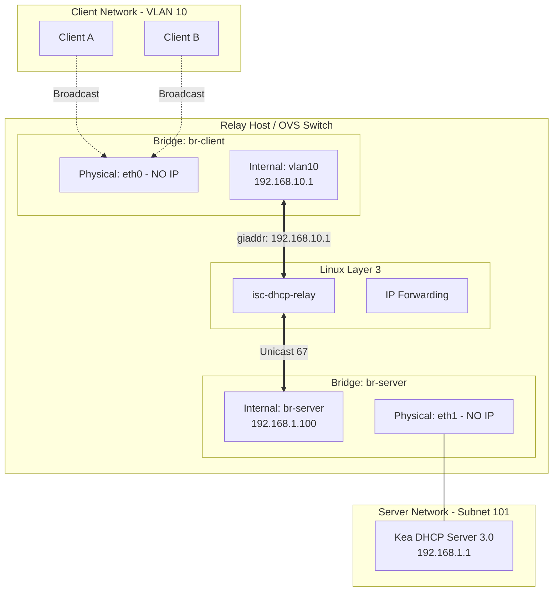

This guide provides an implementation of a DHCP relay environment. It is split into two parts: the **Relay Host (The Switch)** and the **DHCP Server (The Kea Instance)**.

---

# Design Philosophy: Why this Architecture?

Before implementation, it is important to understand the guardrails that make this configuration "production-grade":

1.  **L2 Isolation (The Two-Bridge Rule):** We use two separate Open vSwitch bridges (`br-client` and `br-server`). This ensures the relay host does **not** act as a flat Layer-2 switch. DHCP broadcasts from clients are physically unable to "leak" into the server network. The only path between them is the Layer-3 Relay service.
2.  **Explicit Routing via `giaddr`:** We use the Gateway IP Address (`giaddr`) for subnet selection rather than DHCP Option 82 (because we are taking the simplest path here). This keeps the configuration stateless, transparent, and avoids the "cargo cult" complexity of relay agent information circuits.
3.  **Clean Physical Ports:** Physical interfaces (`eth0`, `eth1`) act as pure L2 pipes. They **never** receive IP addresses directly; all Layer-3 logic is bound to internal OVS interfaces.

---

# Part 1: The DHCP Server (Kea 3.0)
This machine acts as the central IP manager. It sits on the `192.168.1.0/24` network.

### 1. Install ISC Kea 3.0
```bash
# Add the repository
curl -1sLf 'https://dl.cloudsmith.io/public/isc/kea-3-0/setup.deb.sh' | bash

# Install Kea
apt update && apt install -y isc-kea
```

### 2. Configure Kea (`/etc/kea/kea-dhcp4.conf`)
The `relay` block inside `subnet4` is the "anchor." When Kea sees a packet where `giaddr` is `192.168.10.1`, it knows to assign an address from this specific pool.
> **Note:** `libdhcp_legal_log.so` enables forensic logging for DHCP lease activity.

```json
{
  "Dhcp4": {
    "interfaces-config": { "interfaces": ["enp7s0"] },
    "lease-database": {
      "type": "memfile",
      "persist": true,
      "name": "/var/lib/kea/kea-leases4.csv"
    },
    "hooks-libraries": [
      {
        "library": "/usr/lib/x86_64-linux-gnu/kea/hooks/libdhcp_legal_log.so",
        "parameters": {
          "path": "/var/log/kea",
          "base-name": "kea-forensic4"
        }
      }
    ],
    "subnet4": [
      {
        "id": 1,
        "subnet": "192.168.1.0/24",
        "pools": [{ "pool": "192.168.1.10 - 192.168.1.240" }]
      },

      {
        "id": 10,
        "subnet": "192.168.10.0/24",
        "relay": { "ip-addresses": ["192.168.10.1"] },
        "pools": [{ "pool": "192.168.10.10 - 192.168.10.200" }],
        "option-data": [{ "name": "routers", "data": "192.168.10.1" }]
      }
    ],
    "loggers": [
      {
        "name": "kea-dhcp4",
        "severity": "DEBUG",
        "debuglevel": 99, 
        "output_options": [{ "output": "/var/log/kea/kea-dhcp4-debug.log" }]
      }
    ]
  }
}
```
> **Warning:** `debuglevel: 99` is extremely verbose and should not be used in production long-term.

> **Note:** `relay:` keyword here implies the subnet is a relay one that's all the difference isc-kea needs to classify a network as a relay one


### 3. Server-Side Routing
The DHCP Server must know how to route the *response* back to the client network.
```bash
# Tell the server the client network is reached via the Relay Host
ip route add 192.168.10.0/24 via 192.168.1.100
systemctl restart isc-kea-dhcp4-server
```

---

# Part 2: The Relay Host (OVS Switch)

### 1. Networking Infrastructure (OVS)
**Note:** Physical interfaces (`eth0`, `eth1`) must remain "unaddressed." IPs are only assigned to internal OVS ports.

```bash
# Setup Client Bridge (L2 Isolation for Clients)
ovs-vsctl add-br br-client
ovs-vsctl add-port br-client eth0 tag=10
ovs-vsctl add-port br-client vlan10 -- set interface vlan10 type=internal
ovs-vsctl set port vlan10 tag=10

# Setup Server Bridge (L2 Isolation for Upstream)
ovs-vsctl add-br br-server
ovs-vsctl add-port br-server eth1
```

> **Why two bridges?** 
> If you "simplify" this into one bridge, you risk DHCP broadcast leakage. Two bridges ensure the only path between the client and server is the **ISC Relay Service** at Layer 3.

### 2. IP Assignment & L3 Forwarding
```bash
ip link set vlan10 up
ip link set br-server up

# Assign Gateway IP (giaddr) and Relay Source IP
ip addr add 192.168.10.1/24 dev vlan10
ip addr add 192.168.1.100/24 dev br-server

# Enable Layer-3 Forwarding and Fix Reverse Path
sysctl -w net.ipv4.conf.all.rp_filter = 0
sysctl -w net.ipv4.conf.default.rp_filter = 0
sysctl -w net.ipv4.conf.<192.168.1.x interface>.rp_filter = 0
sysctl -w net.ipv4.conf.<192.168.10.x interface>.rp_filter = 0

```

> **Why `ip_forward=1`?** 
> This allows the Linux kernel to route the unicast DHCP packets between the two bridges. It does **not** turn the host into a bridge; OVS still maintains the L2 separation.

### 3. Relay Service
Configure `/etc/default/isc-dhcp-relay`:
```bash
SERVERS="192.168.1.1"
INTERFACES="vlan10 br-server"
```
```bash
systemctl restart isc-dhcp-relay
```
---
The relay service defines the explicit Layer-3 boundary between the isolated
client and server bridges. Only internal OVS interfaces are used.

- `vlan10` is the downstream interface where client DHCP broadcasts arrive.
  Its IP address (`192.168.10.1`) becomes the `giaddr`.
- `br-server` is the upstream interface used to unicast DHCP requests to the
  Kea server.

Physical interfaces (`eth0`, `eth1`) are intentionally excluded to preserve
Layer-2 isolation and prevent broadcast leakage.

---

# Architecture Overview


>Note: Vlans were made off eth0 for testing convienence as it allows flexibility to add multiple vlans simultaneously
---
# Operational Warnings & Verification

### ⚠️ NetworkManager Interference
NetworkManager often tries to "help" by assigning DHCP or Auto-IP to physical ports like `eth0`. This will break the OVS topology. 
*   **Check:** `nmcli device status`
*   **Fix:** Ensure your OVS physical ports are marked as `unmanaged` in NetworkManager.

### ⚠️ ARP / Neighbor Cache
If you move interfaces between bridges or change IPs during testing, your ARP table may become stale, causing the system to appear "randomly broken."
*   **Fix:** Flush the cache if you change the topology: 
    ```bash
    ip neigh flush all
    ```

### 1. Verify Packet Flow
Run this on the **Relay Host**:
```bash
tcpdump -ni br-server udp port 67 -vv
```
**Expected:** You must see a packet from `192.168.1.100` to `192.168.1.1` containing `giaddr 192.168.10.1`.

### 2. Verify Subnet Selection
On the **DHCP Server**, check the Kea logs:
```bash
tail -f /var/log/kea/kea-dhcp4-debug.log | grep "selected"
```
**Expected:** `DHCP4_SUBNET_SELECTED subnet 192.168.10.0/24 selected`. If selection fails, your `giaddr` does not match the `relay` IP in the config.

>NOTE: If you have two dhcp server in stack ,you need to add isc-dhcp-relay setup at the downstream dhcp server as well

Alright, judge + fix mode again.
The **idea** of your note is correct, but the current wording is ambiguous and a bit… hand-wavy. Someone reading it cold could easily misconfigure a chained setup.

Here’s a **clean, precise, production-safe version** you can drop straight into the guide.


---
#### Note: Chained / Downstream DHCP Servers

> **Important:** In a stacked or chained DHCP topology, **every downstream DHCP server must also run a relay**.

 If the relay host is **not the final DHCP authority** but instead forwards requests to an upstream DHCP server, then:

 * The downstream DHCP/DNS server **must run `isc-dhcp-relay`**
 * It must forward requests upstream using its own `giaddr`
 * Subnet selection must remain deterministic at each hop

 This applies in particular when:

 * The relay host also runs **DHCP and DNS locally**, but is not authoritative for all client subnets
 * Multiple DHCP servers are deployed in a hierarchical or tiered design

 In such cases, the relay chain looks like:
```
 Client → Relay Host → Downstream DHCP/DNS → Upstream DHCP Authority
```
 Each relay hop is responsible for:

 * Preserving Layer-2 isolation
 * Setting the correct `giaddr`
 * Forwarding DHCP packets via unicast only

> **Do not assume DHCP packets will be automatically forwarded between servers.**

>**Warning:** DHCP servers do not relay traffic unless explicitly configured to do so.

---
