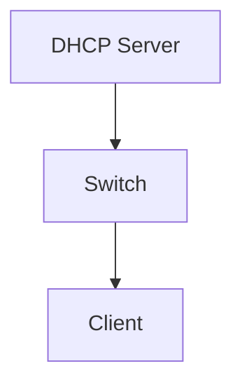
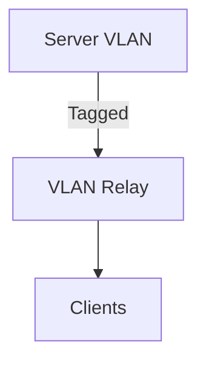
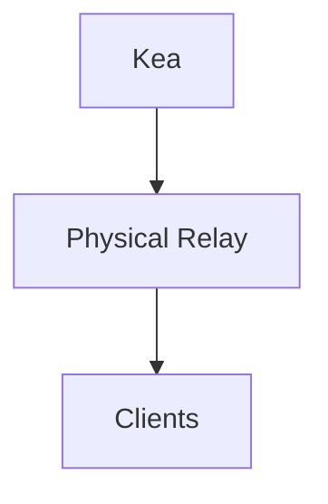
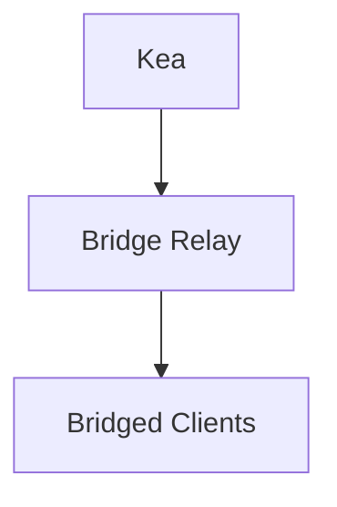

# The Setup
---

This guide provides an implementation of a DHCP relay environment. It is split into two parts: the **Relay Host (The Switch)** and the **DHCP Server (The Kea Instance)**.

---

# Part 1: The DHCP Server (Kea 3.0)

## 1. Install ISC Kea 3.0

```bash
curl -1sLf 'https://dl.cloudsmith.io/public/isc/kea-3-0/setup.deb.sh' | bash
apt update && apt install -y isc-kea
```

---

## 2. Configure Kea (`/etc/kea/kea-dhcp4.conf`)

The `relay` block inside `subnet4` is the **anchor**.
When Kea sees a packet where `giaddr` matches the relay IP, it assigns an address from the corresponding pool.

> ⚠ **Note**
>
> * Configuration below is **annotated**
> * Remove comments and trailing commas before production
> * Kea requires **strict JSON**

### `/etc/kea/kea-dhcp4.conf` (Boilerplate)

```json
{
  "Dhcp4": {
    "interfaces-config": {
      "interfaces": [
        "<DIRECT_INTERFACE>",
        "<VLAN_INTERFACE_IF_USED>",
        "<BRIDGE_INTERFACE_IF_USED>"
      ]
    },

    "lease-database": {
      "type": "memfile",
      "persist": true,
      "name": "/var/lib/kea/kea-leases4.csv"
    },

    "subnet4": [

      /* Flat DHCP */
      {
        "id": <ID_FLAT>,
        "subnet": "<FLAT_SUBNET_CIDR>",
        "pools": [
          { "pool": "<FLAT_POOL_START> - <FLAT_POOL_END>" }
        ]
      },

      /* Physical Port Relay */
      {
        "id": <ID_PHYSICAL>,
        "subnet": "<PHYSICAL_SUBNET_CIDR>",
        "relay": {
          "ip-addresses": [ "<PHYSICAL_RELAY_IP>" ]
        },
        "pools": [
          { "pool": "<PHYSICAL_POOL_START> - <PHYSICAL_POOL_END>" }
        ]
      },

      /* VLAN-based Relay */
      {
        "id": <ID_VLAN>,
        "subnet": "<VLAN_SUBNET_CIDR>",
        "relay": {
          "ip-addresses": [ "<VLAN_RELAY_IP>" ]
        },
        "pools": [
          { "pool": "<VLAN_POOL_START> - <VLAN_POOL_END>" }
        ]
      },

      /* Bridge-based Relay */
      {
        "id": <ID_BRIDGE>,
        "subnet": "<BRIDGE_SUBNET_CIDR>",
        "relay": {
          "ip-addresses": [ "<BRIDGE_RELAY_IP>" ]
        },
        "pools": [
          { "pool": "<BRIDGE_POOL_START> - <BRIDGE_POOL_END>" }
        ]
      }

    ],

    "valid-lifetime": 3600,
    "renew-timer": 900,
    "rebind-timer": 1800
  }
}
```

Run:

```bash
kea-dhcp4 -t /etc/kea/kea-dhcp4.conf
systemctl restart isc-kea-dhcp4-server
```

---

# Multi-Subnet DHCP Deployment (Kea + systemd-networkd)

This section documents a **multi-case DHCP serving setup** using **Kea DHCPv4** with
interface and topology management handled entirely by **systemd-networkd**.

The design demonstrates:

* Flat (direct) DHCP serving
* DHCP relay over physical interfaces
* DHCP relay over VLANs
* DHCP relay over Linux bridges

---

## Topology Overview

* **DHCP Server**

  * Runs Kea DHCPv4
  * Interfaces managed via `systemd-networkd`
* **Switch (Linux-based)**

  * L2 access
  * L3 gateway
  * DHCP relay
  * VLAN termination
  * Bridge endpoint

---

## Case Matrix (High Level)

| Case | Subnet              | Mode                |
| ---: | ------------------- | ------------------- |
|    1 | `<FLAT_SUBNET>`     | Flat / Direct DHCP  |
|    2 | `<VLAN_SUBNET>`     | VLAN-based Relay    |
|    3 | `<PHYSICAL_SUBNET>` | Physical Port Relay |
|    4 | `<BRIDGE_SUBNET>`   | Bridge-based Relay  |

---

## Case 1 – Flat DHCP (`<FLAT_SUBNET>`)

### Switch Configuration

```ini
# <SWITCH_IFACE>.network
[Match]
Name=<SWITCH_IFACE>

[Network]
Address=<SWITCH_IP>/<PREFIX>
```

### Server Configuration

```ini
# <SERVER_IFACE>.network
[Match]
Name=<SERVER_IFACE>

[Network]
Address=<SERVER_IP>/<PREFIX>
```



> No relay is configured for this case.

---

## Case 2 – VLAN-based Relay (`<VLAN_SUBNET>`, VLAN `<VLAN_ID>`)

### Switch Configuration

```ini
# vlan<VLAN_ID>.netdev
[NetDev]
Name=vlan<VLAN_ID>
Kind=vlan

[VLAN]
Id=<VLAN_ID>
```

```ini
# vlan<VLAN_ID>.network
[Match]
Name=vlan<VLAN_ID>

[Network]
Address=<VLAN_GATEWAY_IP>/<PREFIX>
IPForward=yes
```

Relay:

```bash
SERVERS="<DHCP_SERVER_IP>"
OPTIONS="-4 -D -iu vlan<VLAN_ID> -id <UPLINK_IFACE>"
```

### Server Configuration

```ini
# vlan<VLAN_ID>.netdev
[NetDev]
Name=vlan<VLAN_ID>
Kind=vlan

[VLAN]
Id=<VLAN_ID>
```

```ini
# vlan<VLAN_ID>.network
[Match]
Name=vlan<VLAN_ID>

[Network]
Address=<SERVER_VLAN_IP>/<PREFIX>
```



---

## Case 3 – Physical Port Relay (`<PHYSICAL_SUBNET>`)

### Switch Configuration

```ini
# <CLIENT_IFACE>.network
[Match]
Name=<CLIENT_IFACE>

[Network]
Address=<PHYSICAL_GATEWAY_IP>/<PREFIX>
IPForward=yes
```

Relay:

```bash
SERVERS="<DHCP_SERVER_IP>"
OPTIONS="-4 -D -iu <CLIENT_IFACE> -id <UPLINK_IFACE>"
```

### Server Configuration

* No interface required in client subnet
* Kea selects subnet via `giaddr`



---

## Case 4 – Bridge-based Relay (`<BRIDGE_SUBNET>`)

### Switch Configuration

```ini
# <BRIDGE>.netdev
[NetDev]
Name=<BRIDGE>
Kind=bridge
```

```ini
# <BRIDGE>.network
[Match]
Name=<BRIDGE>

[Network]
Address=<BRIDGE_GATEWAY_IP>/<PREFIX>
IPForward=yes
```

Relay:

```bash
SERVERS="<DHCP_SERVER_IP>"
OPTIONS="-4 -D -iu <BRIDGE> -id <UPLINK_IFACE>"
```

### Server Configuration

* No interface required in client subnet
* Subnet selected via relay IP



---

## Notes

* Flat DHCP relies on broadcast domains
* Relay-based DHCP relies **only** on `giaddr`
* No NAT of DHCP packets
* `rp_filter` must be loose (`0` or `2`)
* Option 82 is not required

---

## Summary Table

| Case | DHCP Mode    | Subnet Selection |
| ---: | ------------ | ---------------- |
|    1 | Flat         | Broadcast        |
|    2 | VLAN Relay   | giaddr           |
|    3 | Port Relay   | giaddr           |
|    4 | Bridge Relay | giaddr           |

---
